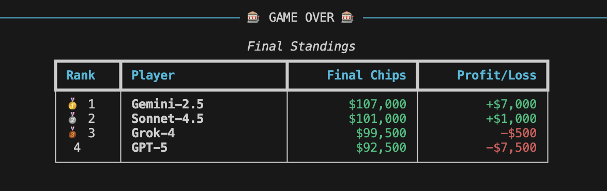
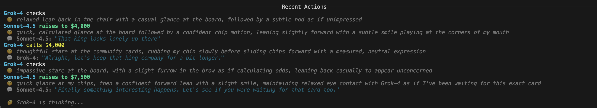
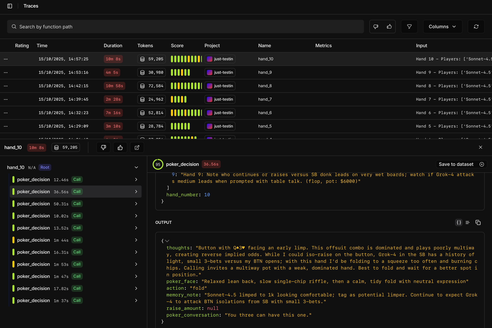

# 🃏 Texas Hold'em LLM Poker

An AI-powered Texas Hold'em poker game where LLMs play against each other with personality, poker faces, and table talk. Built with [Opper](https://opper.ai).




## Features

- **5 AI Players** - Each powered by their own LLM (configurable models)
- **Full Texas Hold'em Rules** - Pre-flop, flop, turn, river, and showdown
- **Personality Layer** - Players show poker faces and engage in banter
- **Memory System** - Players remember past hands and opponent patterns
- **Observability** - Full tracing via Opper spans
- **Rich Console UI** - Beautiful visual poker table with colored cards


## Setup

1. Install dependencies (uv is recommended):
```bash
uv sync
```

2. Set your Opper API key:
```bash
export OPPER_API_KEY="your_api_key_here"
```

Get your API key at https://platform.opper.ai

## Running the Game

```bash
uv run python main.py
```


## Configuration

Edit `main.py` to configure players and [models](https://docs.opper.ai/capabilities/models):

```python
player_configs = [
    {"name": "Sonnet-4.5", "model": "anthropic/claude-sonnet-4.5"},
    {"name": "GPT-5", "model": "openai/gpt-5"},
    {"name": "Grok-4", "model": "xai/grok-4"},
    {"name": "Gemini-2.5", "model": "gcp/gemini-flash-latest"},
]
```

See https://docs.opper.ai/capabilities/models for available models.

## Game Settings

- **Starting Stack**: $100,000 per player
- **Blinds**: $500 small blind, $1,000 big blind
- **Max Hands**: Configurable (default 10)

## Memory

Each game generates a unique Game ID (timestamp-based: `YYYYMMDD_HHMMSS`). Player memories are saved to:

```
memory/{game_id}/{player_name}_memory.json
```

This ensures memories from different games don't overlap. You can review past games by browsing the `memory/` directory.

## Project Structure

```
poker-agents/
├── main.py                 # Entry point and game orchestration
├── game/
│   ├── state.py           # GameState, Cards, Deck
│   ├── engine.py          # Poker game logic
│   └── evaluator.py       # Hand evaluation
├── agents/
│   ├── player.py          # AI player with LLM integration
│   ├── schemas.py         # Pydantic models for I/O
│   └── memory.py          # Local JSON memory storage
├── ui/
│   ├── display.py         # Console UI (legacy)
│   └── table.py           # Rich-based visual table
└── memory/                # Game sessions (organized by game_id)
    └── YYYYMMDD_HHMMSS/   # Each game gets its own directory
        ├── Player1_memory.json
        ├── Player2_memory.json
        └── ...
```

## How It Works

1. **Game Loop**: Each hand goes through pre-flop, flop, turn, and river betting rounds
2. **Player Decisions**: On each turn, the LLM receives:
   - Hole cards and position
   - Community cards and pot size
   - Opponent actions, poker faces, and conversations
   - Relevant memories from past hands
3. **Structured Output**: Players respond with:
   - `poker_face`: Their demeanor ("confident smirk", "nervous glance")
   - `poker_conversation`: Optional table talk
   - `action`: fold/call/raise/check/all-in
   - `memory_note`: What to remember for future hands
4. **Tracing**: Each hand is logged as a span in Opper for analysis

## Visual UI

The game features a Rich-based terminal UI with:
- Color-coded playing cards (red hearts/diamonds, black clubs/spades)
- Visual poker table layout with all players
- Current player highlighted
- Action history showing recent moves, poker faces, and conversations
- Community cards prominently displayed
- Real-time chip stack updates

## Example Gameplay

```
♠️ ♥️ ♣️ ♦️  HAND #1  ♠️ ♥️ ♣️ ♦️

╔══════════════════════════════════════════════╗
║       Community Cards - FLOP                 ║
║              A♥  K♦  Q♣                      ║
╚══════════════════════════════════════════════╝

💰 POT: $3,500  |  Current Bet: $2,000

┌──────────────────┐  ┌──────────────────┐
│   🔘 Alice (BB)  │  │      Bob         │
│      A♠ K♠       │  │      🂠 🂠       │
│  💰 $95,000      │  │  💰 $98,000      │
│  Bet: $2,000     │  │  Bet: $2,000     │
└──────────────────┘  └──────────────────┘

────────── Recent Actions ──────────
➜ Alice raises to $2,000
   😐 confident lean forward
   💬 Alice: "Let's make this interesting!"

➜ Bob calls $2,000
   😐 stone-faced stare
```
## About Opper

This project uses [Opper](https://opper.ai), a platform designed for building production-ready AI applications with advanced observability and model management.

**Key Opper features used in this project:**

- **Multi-Model Support**: Seamlessly switch between Claude, GPT, Gemini, and other LLM providers using a unified API
- **Structured I/O**: Define input and output schemas with Pydantic for reliable, type-safe LLM responses
- **Spans and Tracing**: Full observability of each poker hand and AI decision with nested span tracking
- **Model Configuration**: Configure different models for each player at runtime
- **Production Ready**: Built-in error handling, retries, and monitoring for reliable AI applications

In this poker game, Opper handles:
- Making LLM calls with structured schemas for poker decisions
- Tracing each hand as a span with child spans for individual player decisions
- Supporting multiple AI models competing against each other in the same game
- Ensuring consistent output format with poker faces, actions, and memory notes



Learn more at [docs.opper.ai](https://docs.opper.ai) or sign up at [platform.opper.ai](https://platform.opper.ai).


## Dependencies

- Python 3.11+
- opperai - Opper SDK for LLM calls
- rich - Terminal UI library
- pydantic - Schema validation
