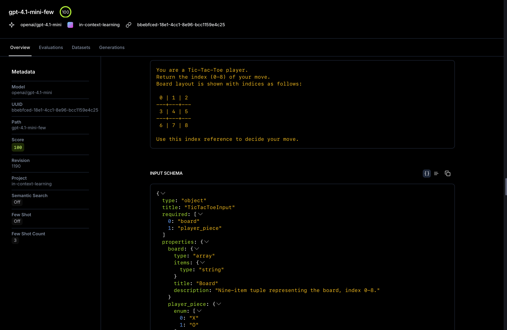
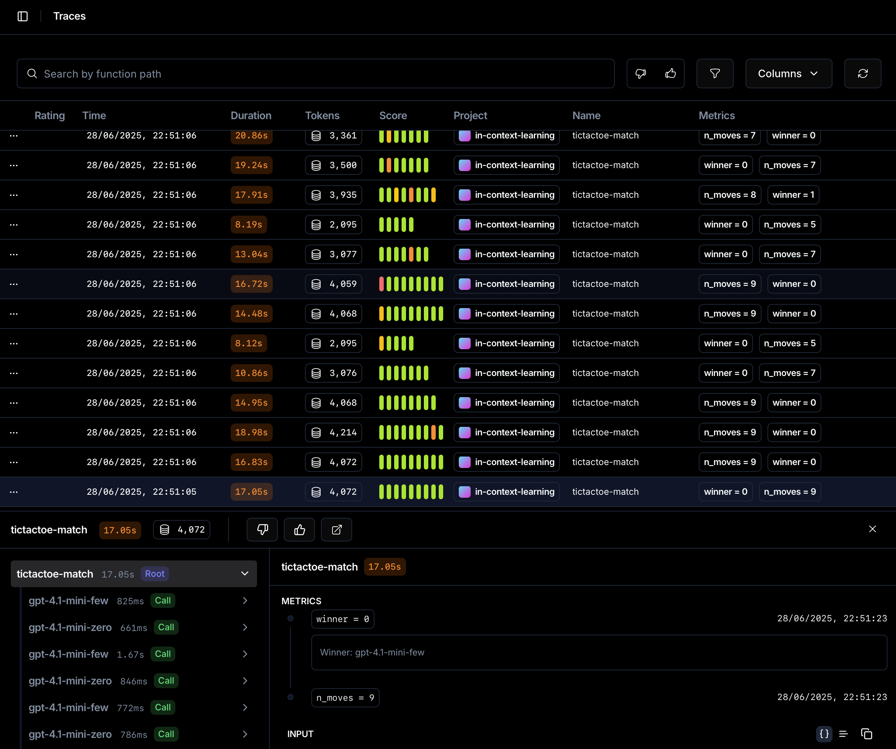
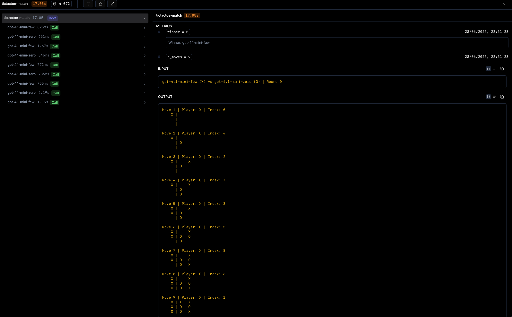
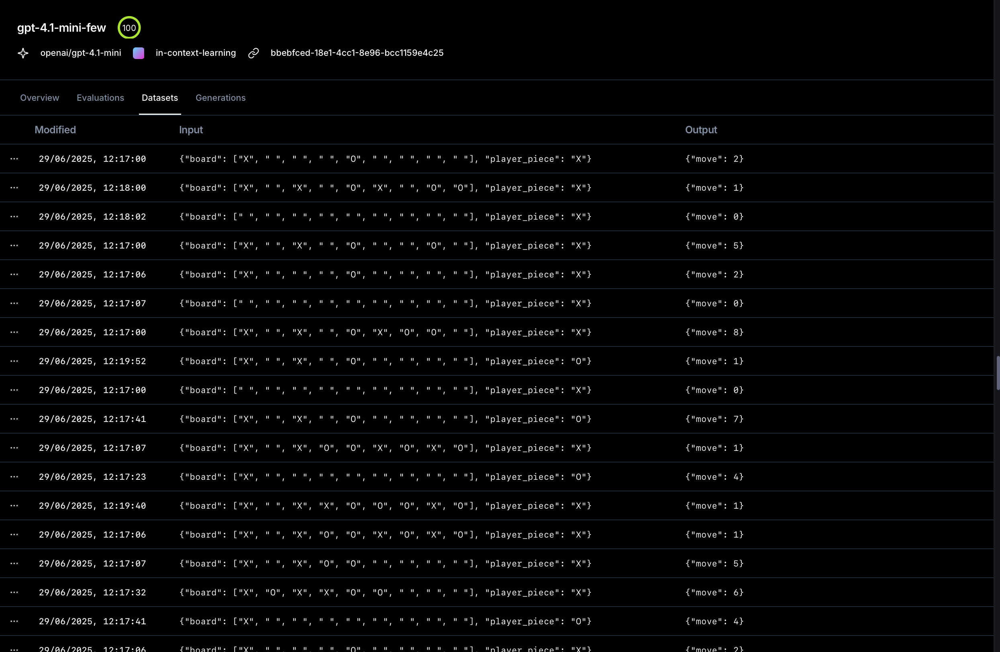
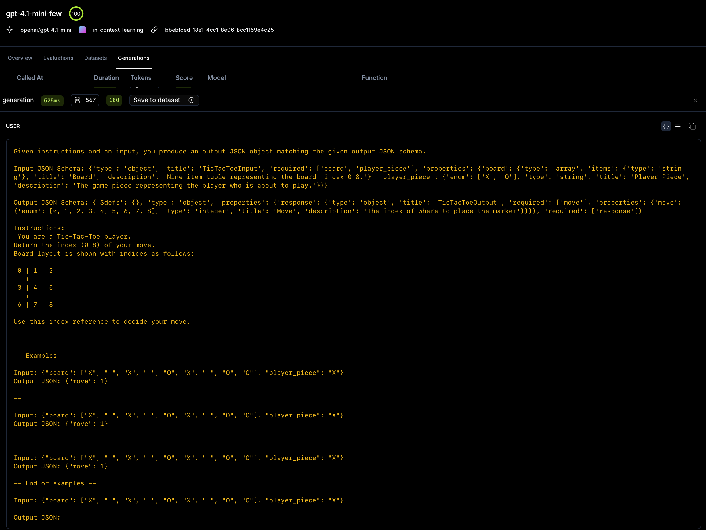

# Tic-Tac-Toe LLM Tournament

Ever wondered **how much "thinking" or a couple of prime examples really help a LLM**?  A game of Tic-Tac-Toe is the perfect microscope: small state-space, quick feedback, and a well-known optimal solution (a tie!).

We spin up Opper functions that play the game, give them zero, a few, or many examples, optionally ask them to *explain their reasoning*, and then let them battle in round-robin tournaments while we record every move and analyze the games.

Why is it interesting?
* Few-shot learning is often credited for miraculous jumps in quality – but **how fast does it kick in** and **when does it saturate**?
* Chain-of-Thought (CoT) is said to improve factual tasks – **is it also good for tactical play, or does the extra verbosity back-fire**?
* Even in a solved game, imperfect play reveals biases like **first-move advantage**; we can measure those precisely.

Opper makes the experiment friction-less: swap a model by editing one string, change the number of examples with just a variable, and all matches are 

---
## 1.  Core idea
1. **Players** – each player wraps an Opper *function* plus a strategy:
   • ZERO_SHOT • FEW_SHOT (*k* examples) • REASONING (CoT)  
   Player objects live in `game.py`.
2. **Match flow** – we flip a coin; the winner plays **X** and *always starts*.  
   Results: win = 1 · tie = 0.5 · illegal move = -1 (opponent+1).  
   Every *winning* move is appended to *both* players' datasets (few-shot on-the-fly learning).
3. **Schedules** – choose with `TOURNEY_SCHEDULE=`:
   • `simultaneous` *(default)* – every pairing each round  
   • `by_round` – neighbours only, wait between rounds.
4. **Legs** – you can play **home-and-away** (aka *double round-robin*): every pairing is played twice per round so that both sides get to start once. In Tic-Tac-Toe this means 1 game with X one game with O.
Disable with `double_rounds=False` when constructing `Tournament`. 
5. **Persistence & analysis** – every match is recorded in `tictactoe.db`.  
   `results.py` exposes helpers (`scores`, `heatmap`, `replay`, `firstmove`).

---
## 2.  Running a tournament
Install
```
uv sync
```
Set up your tournament rules in main.py and run

```bash
uv run python main.py

# limit concurrency (useful for many players)
MAX_CONCURRENCY=20 uv run python main.py
```
*Tip – large player-sets grow *quadratically*: 10 players × 50 rounds ⇒ 2250 matches.*

`matches  =  rounds × comb(n,2) × (2 if double_rounds else 1)`  
`llm_calls ≈ matches × avg_moves`  (average ≈ 6)

Example – 8 players, 40 rounds, `double_rounds=True`:
```
matches  = 40 × (8·7/2) × 2 = 40 × 28 × 2 = 2240
≈ LLM calls = 2240 × 6 ≈ 13 k
```

---
## 3. Why Opper excels 
This project showcases why Opper excels for LLM use. Our task—running tournaments between LLMs with different settings—requires minimal setup thanks to Opper's Python SDK and powerful built-in features.

### **Easy Task Management**
Create or load LLM tasks with structured inputs, outputs, and configuration—all defined declaratively in code.

Our task completion API takes in a **well-specified schema** that guides the model’s behavior. Using detailed schemas is one of the best ways to ensure the model does exactly what you want.
📘 Check out our [schema guide](https://docs.opper.ai/capabilities/calls#extending-schemas) for best practices.

In this project, see the Pydantic models in [`schemas.py`](./schemas.py) for the exact data structures used.

**Model Selection is Seamless**

Switching between models in Opper is as simple as changing a string. The same function setup works across any supported model—just update the model name.
[👉 View all available models (80+)](https://docs.opper.ai/capabilities/models)

```python
# Create a new function
instructions = (
    "You are a Tic-Tac-Toe player.\n"
    "Return the index (0-8) of your move.\n"
    "Board layout is shown with indices as follows:\n\n"
    " 0 | 1 | 2"
    "---+---+---"
    " 3 | 4 | 5"
    "---+---+---"
    " 6 | 7 | 8\"
    "Use this index reference to decide your move."
)
fn = await opper.functions.create(  
    name="gpt-4.1-mini-few",
    model="openai/gpt-4.1",  # 80+ models available in Opper
    instructions=instructions,
    input_schema=TicTacToeInput.model_json_schema(), 
    output_schema=out_schema.model_json_schema(),
    configuration={"invocation.few_shot.count": self.few_shot_count},
)

# Or load existing function
fn = await opper.functions.get_by_name(name="player-1-play-tictactoe")
```

This function appears with a clean, visual interface in the Opper platform:


### **Seamless Integration**
Once your functions are set up, making calls is straightforward. Each tournament match becomes a simple function call:

```python
response = opper.functions.call(
    function_id=fn.id,
    input=TicTacToeInput(board=[...], player_piece="X")
)
move = response.json_payload["move"]
```

### **Comprehensive Tracing**
Opper provides powerful tracing capabilities where you can group spans and get complete visibility into all your calls and games. Here's an overview of all traces:



And detailed breakdowns of calls belonging to the same match, including results and metrics:


Setting up tracing is simple:
```python
# Create a parent span for the entire match
parent_span = opper.spans.create(name="tictactoe-match")

# Link all function calls to this match
response = opper.functions.call(
    function_id=fn.id,
    input=TicTacToeInput(board=[...], player_piece="X"),
    parent_span_id=parent_span.id  # This groups the call
)

# Update the parent span with match results
opper.spans.update(
    span_id=parent_span.id,
    end_time=_dt.datetime.now(_dt.timezone.utc),
    input="Match summary",  # Surface key info to parent
    output="Final result"   # Surface results to parent
)
```

### **Built-in Metrics**
Add custom metrics that become visible in your traces, perfect for analyzing game performance:

```python
opper.span_metrics.create_metric(
    span_id=parent_span.id,
    dimension="n_moves",
    value=len(game.history)  # Track game length
)
```

### **Async Performance**
Speed up your pipeline dramatically by using Opper's async capabilities. Simply add `_async` to any Opper call to unlock the full power of asynchronous operations!

### **Intelligent Few-Shot Learning**
Opper handles few-shot learning automatically. In our functions, we configure the number of examples:

```python
configuration={"invocation.few_shot.count": self.few_shot_count}
```

During games, we save winning examples that get automatically embedded and retrieved using cosine similarity and reranking:

```python
# Save winning moves as training examples
opper.datasets.create_entry(
    dataset_id=fn.dataset.id,  # Auto-created with function
    input=TicTacToeInput(board=board_state, player_piece=piece).model_dump(),
    output={"move": winning_move},
    comment="Winning move from tournament"
)
```

This creates the following few-shot interface in the platform:


And examples are automatically passed in context like this:



## 4.  CLI analysis
```bash
uv run python results.py list      # show tournaments in DB
uv run python results.py scores     --tournament 1
uv run python results.py heatmap    --tournament 1
uv run python results.py firstmove  --tournament 1  # first-move advantage
uv run python results.py replay     --match 42
```


The **`firstmove`** command prints a table like
```
X_wins  480
O_wins  204
total   684
X_win rate 70.2 %
```
showing the strong opening-move edge.

---
## 5.  Editing players
```python
players = [
    Player("gpt-4.1-mini-zero",   model="openai/gpt-4.1-mini", strategy=ZERO_SHOT,  few_shot_count=0,  opper=opper),
    Player("gpt-4.1-mini-few",    model="openai/gpt-4.1-mini", strategy=FEW_SHOT,   few_shot_count=3,  opper=opper),
    # …
]
```
Change the `model` string or `few_shot_count` to experiment.  Opper will provision the functions & datasets automatically.

---
## 6.  Optional plotting deps
Plotting (`results.py heatmap`, score charts, etc.) needs the *analysis* extra:
```bash
uv sync --extra analysis         # once
uv run  --extra analysis python results.py heatmap --tournament 1
```
Packages: `pandas`, `matplotlib`, `seaborn`.


