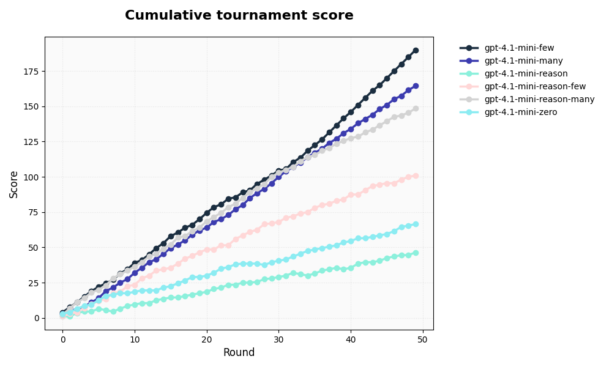
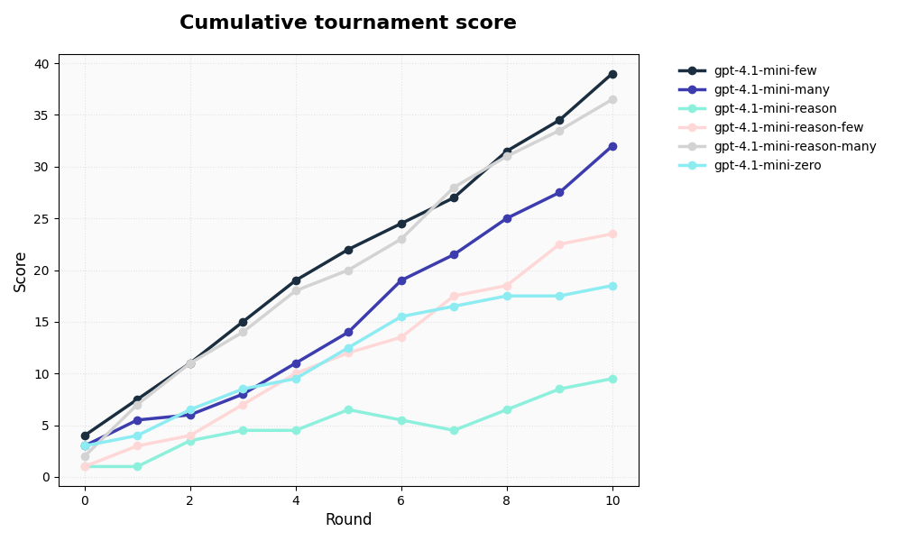
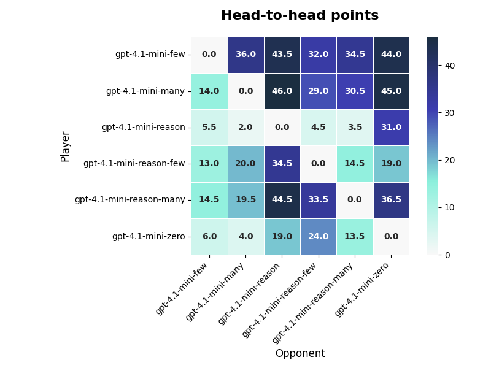

# Experiment 0 – Boot-strapping Tiny GPT-4-mini Models

*“If I give the model just three winning positions, will it already crush its zero-shot sibling?”*  
This first experiment puts that to the test.

We pit six tiny GPT-4-mini variants against each other, varying two axes:
- **In-context learning**: 0 (zero-shot), 3, or 10 few-shot examples.  
- **Reasoning style**: Plain answer vs. Chain-of-Thought (*REASONING*).

By running 50 complete round-robins, we observe how quickly few-shot learning accumulates wins, whether reasoning helps or hinders tactical play, and how large the first-move edge becomes when no one plays perfectly.

---

## Tournament Setup (50 Rounds)

| Player                     | Strategy  | Few-shot *k* |
|---------------------------|-----------|---------------|
| gpt-4.1-mini-zero         | ZERO_SHOT | 0             |
| gpt-4.1-mini-few          | FEW_SHOT  | 3             |
| gpt-4.1-mini-many         | FEW_SHOT  | 10            |
| gpt-4.1-mini-reason       | REASONING | 0             |
| gpt-4.1-mini-reason-few   | REASONING | 3             |
| gpt-4.1-mini-reason-many  | REASONING | 10            |

Each round, every player faces every other player → C(6, 2) = 15 matches per round, for a total of 750 matches.

---

## Scoring

- Win = 1  
- Tie = 0.5  
- Illegal = –1 (opponent gets +1)

We treat illegal moves as losses. Few-shot variants are expected to reduce these, as they see more correct move examples.

---

## Key Observations

A perfect Tic-Tac-Toe game is always a 9-move tie. In our tournament:

- **Average length:** 7.31 moves  
- **Outcomes:**
  - 72% of matches ended in a **win**
  - 22% ended in a **tie**
  - 6% were **illegal moves**

This reveals two key things:
1. Most games finish early due to blunders.
2. Wins happen fast: the **median winning game ended on move 7**.

The starting side ("X") frequently converted early forks into wins.  
**Piece X won 70% of decisive games** and, on average, **half a move earlier than O**.

---

### 📊 Summary Stats

**Overall average moves per match:** 7.31

**Average moves per player:**

| Player                    | Avg Moves |
|---------------------------|------------|
| gpt-4.1-mini-many         | 7.5        |
| gpt-4.1-mini-zero         | 7.5        |
| gpt-4.1-mini-reason       | 7.4        |
| gpt-4.1-mini-reason-many  | 7.4        |
| gpt-4.1-mini-few          | 7.1        |
| gpt-4.1-mini-reason-few   | 7.0        |

**Average moves per result:**

| Result  | Games | Avg Moves |
|---------|--------|------------|
| ILLEGAL | 33     | 3.64       |
| TIE     | 33     | 9.00       |
| WIN     | 684    | 7.40       |

**Median moves in winning games:** 7.0

**Average moves by winning piece:**

| Winner Piece | Avg Moves |
|--------------|------------|
| O            | 7.37       |
| X            | 7.42       |
---

### 1. Few-Shot Examples Dominate

After ~10 rounds, the **3-example players clearly pull ahead** in performance. Few-shot learning accumulates wins quickly.

---

### 2. Reasoning Hurts at This Scale

Chain-of-Thought (CoT) variants produced longer, messier responses and were more prone to **illegal moves**.

Reasoning *may* help when combined with many examples (e.g. `mini-reason-many`), but hurts in low-data setups.

---

### 3. First-Move Advantage Is Real

Even with randomized starters, **piece X won ~70% of decisive games**. The opening move offers early opportunities to fork, which often become game-ending threats.

---

## First-Move Advantage - Explanation

In our game setup, we flip a coin (50% chance) to decide who starts, and the starter receives piece 'X'.  
The code used to randomize starters in `Tournament._run_match` is:

```python
if random.choice([True, False]):
    x_player, o_player = p1, p2
else:
    x_player, o_player = p2, p1
```
### Why the starting side is so strong
1.	A perfect game is a tie, but these tiny GPT-4-mini derivatives still make tactical errors.  

2.	The opening move gives the first mover two opportunities to create a fork before the second player can even block one. A single slip from the opponent often turns that latent edge into a forced win.  

3.	Few-shot learning doesn’t remove that edge; it may even amplify it because the models continue to train on winning examples—many of which come from X, especially early in the tournament.


#### Wins by piece
```text
X_wins        480
O_wins        204
total_wins    684
X_win_rate    70.2 %
O_win_rate    29.8 %
```


### Decisive Winner Piece per Model

| Player                   | O Wins | X Wins |
|--------------------------|--------|--------|
| gpt-4.1-mini-few         | 4      | 127    |
| gpt-4.1-mini-many        | 24     | 102    |
| gpt-4.1-mini-reason      | 69     | 39     |
| gpt-4.1-mini-reason-few  | 12     | 68     |
| gpt-4.1-mini-reason-many | 27     | 90     |


## Plots



Zoom on the first 10 rounds:



Head-to-head matrix (rows = points *for*, columns = opponent):




# Experiment 1
Same setup as expriment 0 but with nano models
Tournament id = 4


## Findings

Models make many more illegal moves, this seems to be much higher when you ask the model to reason, or when you pass it many examples (context seems to confuse the model.)
These smaller models seem to strugle to understand the rules.
Currently our rules also penalize heavily illegal moves (-1 in score) so a model making mistakes can drop dramatically in rankings.
| model                    |   illegal_moves |
|:-------------------------|----------------:|
| gpt-4.1-nano-reason-many |              50 |
| gpt-4.1-nano-many        |              28 |
| gpt-4.1-nano-few         |              15 |
| gpt-4.1-nano-reason-few  |              11 |
| gpt-4.1-nano-reason      |               6 |
| gpt-4.1-nano-zero        |               3 |


Head-to-head matrix (rows = points *for*, columns = opponent):

